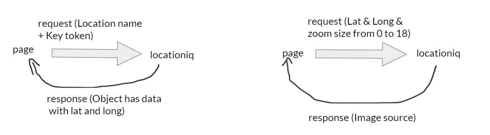

# City Explorer

**Author**: Mahmoud Saadeh
**Version**: 1.0.0

## Overview

This website allows users to explore any location by typing the location name in the input field and as a result, the Lat and the Long will be displayed with a map of that location and you can zoom in and out.

## Getting Started

Used Libraries
    - React
    - Axios
    - Bootstrap
I also used locationiq API, so first signup and copy your key, and put it inside an env file.

## Architecture

for the design, I only used Bootstrap library and some CSS.

## Change Log

23-5-2021 7:00pm - Application now has a fully-functional location search.

## Credit and Collaborations

[React](https://reactjs.org/)
[Bootstrap](https://react-bootstrap.netlify.app/)
[Axios](https://axios-http.com/)
[locationiq](https://locationiq.com/)

## Request and Response

Name of feature: Explore Location

Estimate of time needed to complete: 1:00 hour

Actual time needed to complete: 1:30 hour
-----------------------------------------------------
Name of feature: Zoom

Estimate of time needed to complete: 10 minutes

Actual time needed to complete: 10 minutes
-----------------------------------------------------
Name of feature: Styling

Estimate of time needed to complete: 30 minutes

Actual time needed to complete: 1 hour