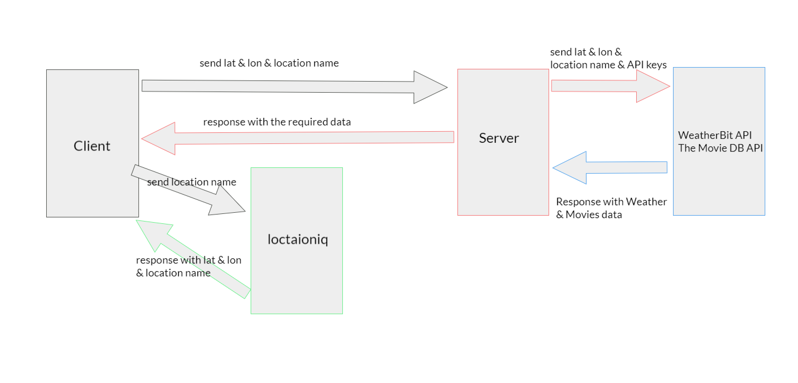

# [City Explorer](https://city-explorer-mahmoud.netlify.app/)

**Author**: Mahmoud Saadeh
**Version**: 1.3.0

## Overview

This website allows users to explore any location by typing the location name in the input field and as a result, the Lat and the Long will be displayed with a map of that location and you can zoom in and out.
the second feature is that when you click explore the weather for 16 days will be displayed.
the third feature is that when you click explore the top 20 or less movies related to the location will be displayed.
the server side for this website is in this repo [city-explorer-api](https://github.com/Mahmoud-Saadeh/city-explorer-api)

## Getting Started

Used Libraries - React - Axios - Bootstrap
I also used locationiq API, so first signup and copy your key, and put it inside an env file.

## Architecture

for the design, I only used Bootstrap library and some CSS.

## Change Log

23-5-2021 7:00pm - Application now has a fully-functional location search.
24-5-2021 6:00pm - Application now has a weather feature and a server.
26-5-2021 7:30pm - Application now has the top 20 Movies.

## Credit and Collaborations

[React](https://reactjs.org/)
[Bootstrap](https://react-bootstrap.netlify.app/)
[Axios](https://axios-http.com/)
[locationiq](https://locationiq.com/)
[WeatherBit API](https://www.weatherbit.io/api)
[The Movie DB API Docs](https://developers.themoviedb.org/3/getting-started/introduction)

## Request and Response

## Name of feature: Explore Location

Estimate of time needed to complete: 2:00 hour

Actual time needed to complete: 2:30 hour

## Name of feature: Weather

Estimate of time needed to complete: 0.5 hour

Actual time needed to complete: 1:00 hour

## Name of feature: Movies

Estimate of time needed to complete: 1:00 hour

Actual time needed to complete: 1:30 hour
